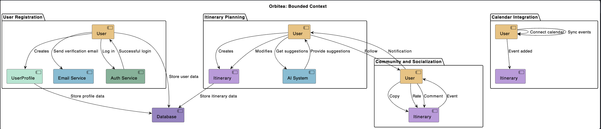

# Orbitea [WIP]

[](https://sonarcloud.io/summary/new_code?id=Edain92_orbitea-monorepo)
[](https://sonarcloud.io/summary/new_code?id=Edain92_orbitea-monorepo)
[](https://sonarcloud.io/summary/new_code?id=Edain92_orbitea-monorepo)

An AI-powered travel management app leveraging DDD, design patterns, CQRS, and GPT-4 integration for dynamic itinerary planning.

**Read about the full idea for this project [here](docs/IDEA.md)!**


---

## Table of Contents

1. [Bounded Context Definition](#bounded-context-definition)
    - [User Registration and Authentication](#user-registration-and-authentication)
    - [Itinerary Planning](#itinerary-planning)
2. [How to Install and Run the Project](#how-to-install-and-run-the-project)
3. [How to Use the Project](#how-to-use-the-project)
4. [How to Test the Project](#how-to-test-the-project)
    - [Unit Testing](#unit-testing)
    - [E2E Testing](#e2e-testing)

### Bounded Context Definition



#### User Registration and Authentication

This Bounded Context is responsible for user authentication and management. It includes functionalities such as user registration, login, and profile management. Its primary focus is on maintaining user accounts, ensuring secure access, and managing user-related data.

_Entities and Aggregates:_

- User Account: Represents the user's account information, including email, password, and other relevant details.
- User Profile: Contains additional user information, such as name, avatar, and preferences.

_Value Objects:_

- Email: Represents the email address associated with a user's account.
- Password: Encrypted user password stored securely.

_Domain Events:_

- User Registered: Fired when a new user successfully registers an account.
- User Logged In: Triggered upon successful user login.
- User Profile Updated: Raised when a user's profile information is updated.

_Use Cases:_

- Register User: Handles the process of user registration by validating input and creating a new user account.
- Login User: Manages user authentication, verifying credentials and granting access upon successful login.
- Update User Profile: Allows users to modify their profile information, such as changing their avatar or updating preferences.

_Integration Points:_

- Database: Stores user account and profile information securely.
- Email Service: Sends confirmation emails, password reset requests, etc.
- Authentication Service: Manages user authentication and token generation.

_Events to Other Bounded Contexts:_

- User Registered event can trigger actions in other contexts, such as notifying the "Community and Socialization" context to create an initial social profile for the user.

This Bounded Context collaborates closely with other contexts like "Community and Socialization" for user interactions and "Itinerary Planning" for personalized travel planning. It ensures a secure and seamless user experience by managing user accounts, authentication, and related processes.

#### Itinerary Planning

This Bounded Context is dedicated to the process of planning travel itineraries for users. It revolves around assisting users in creating well-structured travel plans based on their preferences, destinations, and available time. The context involves interactions with an AI system to suggest optimal plans.

*Entities and Aggregates:*

- User: Represents the user who is planning the travel itinerary.
- Itinerary: Contains information about the planned travel schedule, including destinations, activities, and time frames.
- AI System: A separate system that assists in generating itinerary suggestions.

*Value Objects:*

- Destination: Represents a travel destination, including information like location, name, and attractions.
- Activity: Describes an activity or event to be included in the itinerary, such as sightseeing, dining, or adventure.

*Domain Events:*

- Itinerary Created: Raised when a user successfully creates a new travel itinerary.
- Itinerary Updated: Triggered upon modifications to an existing itinerary.
- AI Query Requested: Fired when a user requests AI suggestions for itinerary planning.

*Use Cases:*

- Create Itinerary: Manages the process of creating a new travel itinerary, including selecting destinations, activities, and time frames.
- Update Itinerary: Allows users to modify an existing itinerary by adding or removing destinations and activities.
- Get AI Suggestions: Interacts with the AI system to retrieve itinerary suggestions based on user preferences and constraints.

*Integration Points:*

- AI System: Communicates with the AI system to provide itinerary suggestions and recommendations.
- Database: Stores user-generated itineraries and relevant details.

*Events to Other Bounded Contexts:*

- Itinerary Created and Itinerary Updated events could inform the "Community and Socialization" context of newly created itineraries for sharing and interaction.

This Bounded Context collaborates with other contexts like "Community and Socialization" for sharing travel plans.

---

### How to Install and Run the Project

  ```bash
  npm install
  npm run start
  ```

### How to Use the Project

- You can access to this route in your browser:

  _<http://localhost:3000/ping>_

- or import this cURL into your Postman:

  ```bash
  curl --location 'http://localhost:3000/ping'
  ```

**The request reponse is going to be a message like this: "pong".**

### How to Test the Project

#### Unit Testing

  ```bash
  npm run test
  ```

#### E2E Testing

  ```bash
  npm run test:e2e
  ```

---

[](https://sonarcloud.io/summary/new_code?id=Edain92_orbitea)
