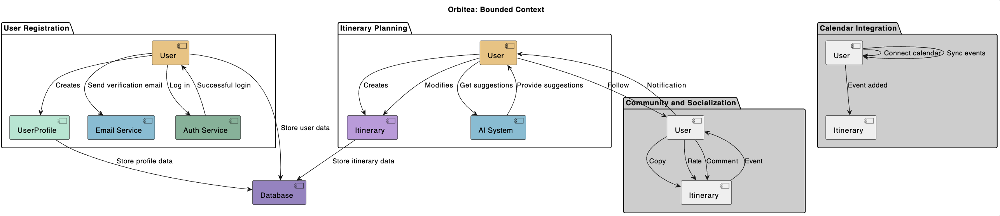
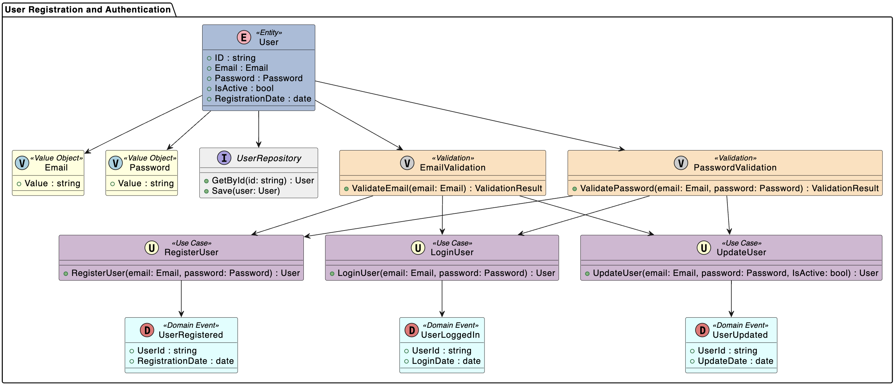
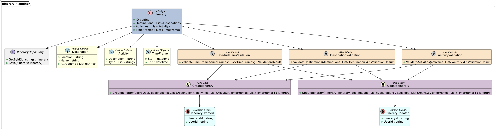

# Orbitea [WIP]

[](https://sonarcloud.io/summary/new_code?id=Edain92_orbitea-monorepo)
[](https://sonarcloud.io/summary/new_code?id=Edain92_orbitea-monorepo)
[](https://sonarcloud.io/summary/new_code?id=Edain92_orbitea-monorepo)
[](https://sonarcloud.io/summary/new_code?id=Edain92_orbitea-monorepo)
[](https://sonarcloud.io/summary/new_code?id=Edain92_orbitea-monorepo)

[](https://sonarcloud.io/summary/new_code?id=Edain92_orbitea-monorepo)
[](https://sonarcloud.io/summary/new_code?id=Edain92_orbitea-monorepo)
[](https://sonarcloud.io/summary/new_code?id=Edain92_orbitea-monorepo)
[](https://sonarcloud.io/summary/new_code?id=Edain92_orbitea-monorepo)
[](https://sonarcloud.io/summary/new_code?id=Edain92_orbitea-monorepo)
[](https://sonarcloud.io/summary/new_code?id=Edain92_orbitea-monorepo)

An AI-powered travel management app leveraging DDD, design patterns, CQRS, and AI integration for dynamic itinerary planning.

**Read about the full idea for this project [here](docs/IDEA.md)!**


---

## Table of Contents

1. [Bounded Context Definition](#bounded-context-definition)
   - [User Registration and Authentication](#user-registration-and-authentication)
   - [Itinerary Planning](#itinerary-planning)
2. [How to Install and Run the Project](#how-to-install-and-run-the-project)
3. [How to Use the Project](#how-to-use-the-project)
4. [How to Test the Project](#how-to-test-the-project)
   - [Unit Testing](#unit-testing)
   - [E2E Testing](#e2e-testing)

### Bounded Context Definition



#### User Registration and Authentication

This Bounded Context is responsible for user authentication and management. It includes functionalities such as user registration, login, and profile management. Its primary focus is on maintaining user accounts, ensuring secure access, and managing user-related data.



<details>
<summary>Domain analysis</summary>

_Entities and Aggregates:_

- User: Represents the user's account information, including email, password, and other relevant details.

_Value Objects:_

- Email: Represents the email address associated with a user's account.
- Password: Encrypted user password stored securely.

_Domain Events:_

- User Registered: Fired when a new user successfully registers an account.
- User Logged In: Triggered upon successful user login.
- User Profile Updated: Raised when a user's profile information is updated.

_Use Cases:_

- Register User: Handles the process of user registration by validating input and creating a new user account.
- Login User: Manages user authentication, verifying credentials and granting access upon successful login.
- Update User Profile: Allows users to modify their profile information, such as changing their avatar or updating preferences.

_Validations:_

- User Registration: Verification of email availability, password strength, confirmation of matching passwords, and duplicate registration prevention.
- Login: Verify user-provided credentials to ensure they match stored records.
- Profile Update: Implement validations to ensure that profile updates are consistent and secure, and that changes are valid.

This Bounded Context collaborates closely with "Itinerary Planning" for personalized travel planning. It ensures a secure and seamless user experience by managing user accounts, authentication, and related processes.

</details>

#### Itinerary Planning

This Bounded Context is dedicated to the process of planning travel itineraries for users. It revolves around assisting users in creating well-structured travel plans based on their preferences, destinations, and available time. The context involves interactions with an AI system to suggest optimal plans.



<details>
<summary>Domain analysis</summary>

_Entities and Aggregates:_

- User: Represents the user who is planning the travel itinerary.
- Itinerary: Contains information about the planned travel schedule, including destinations, activities, and time frames.

_Value Objects:_

- Destination: Represents a travel destination, including information like location, name, and attractions.
- Activity: Describes an activity or event to be included in the itinerary, such as sightseeing, dining, or adventure.

_Domain Events:_

- Itinerary Created: Raised when a user successfully creates a new travel itinerary.
- Itinerary Updated: Triggered upon modifications to an existing itinerary.
- AI Query Requested: Fired when a user requests AI suggestions for itinerary planning.

_Use Cases:_

- Create Itinerary: Manages the process of creating a new travel itinerary, including selecting destinations, activities, and time frames.
- Update Itinerary: Allows users to modify an existing itinerary by adding or removing destinations and activities.
- Get AI Suggestions: Interacts with the AI system to retrieve itinerary suggestions based on user preferences and constraints.

_Validations:_

- Validation of Dates and Times: Ensure that the dates and times entered for the TimeFrames are consistent and that the planned activities do not overlap in time.
- Destination Validation: Verify that the destinations entered exist.
- Validation of Activities: Verify that the activities entered are valid and available at the selected destination.

</details>

---

### How to Install and Run the Project

```bash
npm install
npm run start
```

### How to Use the Project

- You can access to this route in your browser:

  - Local: _<http://localhost:3000/ping>_
  - Web Server: _<https://orbitea-service.onrender.com/ping>_

- or import this cURL into your Postman:

  ```bash
  curl --location 'http://localhost:3000/ping'
  ```

**The request reponse is going to be a message like this: "pong".**

### How to Test the Project

#### Unit Testing

```bash
npm run test
```

#### E2E Testing

```bash
npm run test:e2e
```

---

[](https://sonarcloud.io/summary/new_code?id=Edain92_orbitea)
